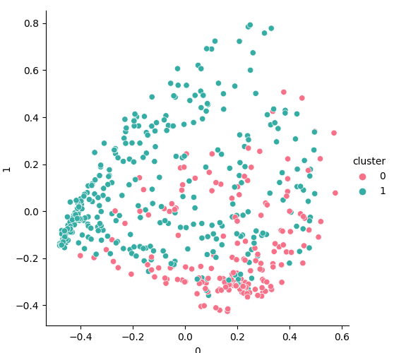
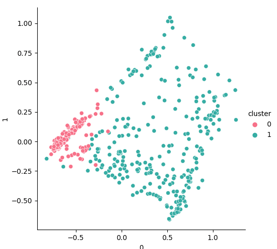

# K-medoids (Partitioning Around Medoids)

PAM k-medoids implementation for classes of Mathematical Foundations of Artificial Intelligence
and Cyber-Security at AMU Poznań.

dataset:
https://www.kaggle.com/arjunbhasin2013/ccdata

Visualization of clustering first 500 data entries (with vector normalization).

Visualization of clustering first 500 data entries (with standarization).

